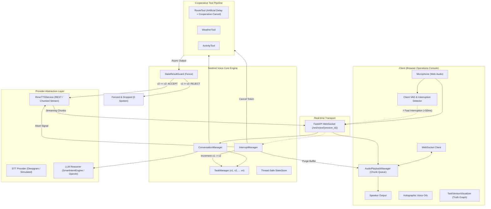

# SENTINEL VOICE — Architecture Specification

> **"When the conversation changes, the AI changes with it."**

---

## 1. System Overview

Traditional conversational voice systems operate under an implicit assumption of serial turn-taking:
1. User speaks.
2. System processes (LLM + Tools).
3. System speaks until completion.

In real-world full-duplex conversations, users frequently update constraints mid-flight:
* While the AI is speaking.
* While a slow tool is crunching data.
* While the LLM is generating tokens.

Without atomic task versioning and fencing, traditional voice agents speak **stale results** (e.g., suggesting a 7-hour highway route after the user expressly blurted "Wait, avoid highways, find the cheapest route!").

**SENTINEL VOICE** introduces a **Task Versioning & Conversation Truth Engine** that couples immediate voice interruption with deterministic task fencing, ensuring zero stale responses are ever spoken.

---

## 2. End-to-End Architecture Diagram



---

## 3. Core Components

### 3.1 Task Versioning Engine (`TaskManager`)
Every user instruction instantiates or increments a `Task`:
* `session_id`: Unique conversation session.
* `task_id`: Unique identifier for the goal.
* `current_version`: Integer strictly monotonic increment ($1, 2, \dots, n$).
* `intent`: Active parsed goal.
* `constraints`: Dictionary of active filters (e.g. `highway_allowed: False`, `route_preference: "cheapest"`).
* `version_history`: List of all previous iterations tagged with status (`INTERRUPTED`, `CANCELLED`, `COMPLETED`).

### 3.2 Stale Result Guard (`StaleResultGuard`)
An independent gatekeeper checking:
```python
if result.task_version != current_task_version:
    reject_result()  # Fenced from TTS, increment telemetry
else:
    accept_result()  # Authorized for Rime synthesis
```
This ensures that even if an asynchronous thread or external API returns late, its output is strictly suppressed.

### 3.3 Audio Playback Manager (`AudioPlaybackManager`)
Manages chunked delivery to the client:
* Immediately purges queued chunks when `stop()` is called.
* Records exact `stop_latency_ms` (typically $< 10\text{ms}$).
* Invalidates the active version token so in-flight audio is discarded.

### 3.4 Rime TTS Service (`RimeTTSService`)
* Native integration with Rime TTS endpoints (`https://users.rime.ai/v1/rime-tts`).
* Configurable model (`mist`, `arcana`), speaker (`amber`, `marina`), sample rate, and audio format.
* Dynamic chunked streaming with per-chunk cancellation checks.
* Transparent synthetic fallback synthesizer for offline/local development without fake credentials.

### 3.5 Multilingual Code-Switching Layer (`SmartIntentEngine`)
* Recognizes mixed Tamil-English (Tanglish) patterns (e.g. `Chennai-ku fastest route find pannu, but highway avoid pannanum`).
* Preserves destination entities and negations across turns.
* Formulates natural, conversational spoken responses.
